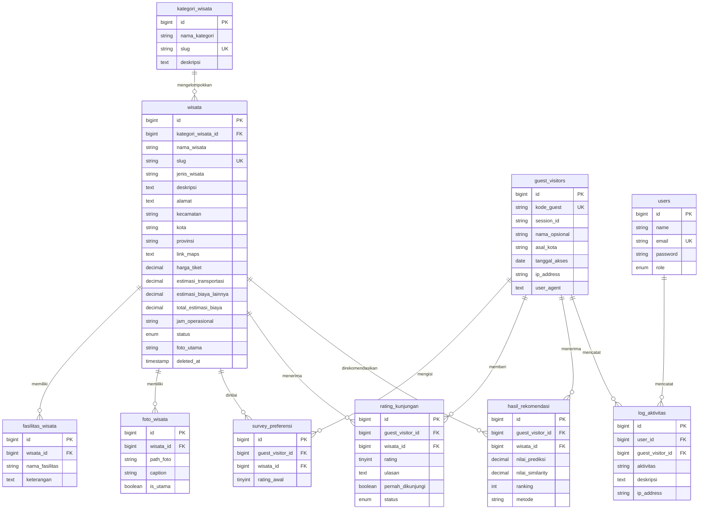

# Dokumentasi Database Sistem Rekomendasi Wisata Makassar

## Ringkasan

Database menyimpan katalog wisata, identitas pengunjung tanpa akun, rating awal untuk *User-Based Collaborative Filtering*, hasil rekomendasi, ulasan kunjungan, dan aktivitas sistem. Akun pada tabel `users` dikhususkan untuk admin.

## Fungsi tabel

| Tabel | Fungsi |
|---|---|
| `users` | Menyimpan akun admin yang dapat masuk ke halaman pengelolaan. |
| `kategori_wisata` | Master kategori yang mengelompokkan destinasi wisata. |
| `wisata` | Menyimpan profil destinasi, lokasi, biaya, jam operasional, status, dan foto utama. Data memakai *soft delete*. |
| `fasilitas_wisata` | Menyimpan daftar fasilitas yang dimiliki setiap destinasi. |
| `foto_wisata` | Menyimpan galeri banyak foto untuk setiap destinasi. |
| `guest_visitors` | Menyimpan identitas teknis wisatawan tanpa login berdasarkan kode guest dan sesi. |
| `survey_preferensi` | Matriks rating awal guest terhadap wisata sebagai masukan Collaborative Filtering. |
| `rating_kunjungan` | Menyimpan rating dan ulasan opsional setelah kunjungan serta status moderasinya. |
| `hasil_rekomendasi` | Menyimpan skor prediksi, similarity, dan urutan rekomendasi untuk guest. |
| `log_aktivitas` | Menyimpan jejak aktivitas penting admin atau guest. |

## Relasi antar tabel

- Satu `kategori_wisata` memiliki banyak `wisata`; satu wisata berada dalam satu kategori.
- Satu `wisata` memiliki banyak `fasilitas_wisata` dan `foto_wisata`.
- Satu `guest_visitors` dan satu `wisata` masing-masing dapat memiliki banyak `survey_preferensi`. Pasangan guest-wisata dibuat unik agar rating awal tidak ganda.
- Satu `guest_visitors` dan satu `wisata` masing-masing dapat memiliki banyak `rating_kunjungan`.
- Satu `guest_visitors` dan satu `wisata` masing-masing dapat memiliki banyak `hasil_rekomendasi`.
- Satu `users` atau `guest_visitors` dapat memiliki banyak `log_aktivitas`.

## ERD

## Alur data rekomendasi

1. Wisatawan membuka situs tanpa login.
2. Saat fitur rekomendasi digunakan, sistem membuat atau mengambil `guest_visitors` berdasarkan sesi. `kode_guest` dapat dibentuk dengan pola `GST-YYYYMMDD-random`.
3. Wisatawan memberi rating 1–5 terhadap beberapa destinasi pada survei preferensi.
4. Sistem menyimpan setiap rating awal ke `survey_preferensi`. Kombinasi `guest_visitor_id` dan `wisata_id` bersifat unik.
5. Proses *User-Based Collaborative Filtering* membentuk matriks user-item, mencari guest lain dengan pola rating serupa, lalu menghitung prediksi destinasi yang belum dinilai guest aktif.
6. Sistem menyimpan nilai prediksi, similarity, dan ranking ke `hasil_rekomendasi`.
7. Wisatawan melihat daftar hasil yang diurutkan berdasarkan ranking atau nilai prediksi.

## Alur hasil rekomendasi dan rating kunjungan

- Setiap proses rekomendasi mengganti hasil lama milik guest untuk mencegah ranking ganda. Hasil menyimpan prediksi, similarity, ranking, dan penanda metode normal atau fallback.
- Reset rekomendasi menghapus `survey_preferensi` dan `hasil_rekomendasi` milik guest, tetapi mempertahankan `guest_visitors` sebagai identitas sesi dan riwayat log.
- Rating kunjungan dibuat terpisah dari survei preferensi karena merepresentasikan pengalaman setelah berkunjung.
- Rating baru berstatus `pending`. Hanya rating `disetujui` yang masuk rata-rata dan daftar ulasan publik; rating `ditolak` tetap tersedia sebagai riwayat moderasi sampai admin menghapusnya.

## Integritas data

- Semua foreign key telah diindeks oleh migration Laravel.
- Data turunan destinasi dan guest menggunakan `cascadeOnDelete()` jika aman. Log audit dan rating guest opsional memakai `nullOnDelete()` agar riwayat tetap tersedia.
- Slug kategori, slug wisata, dan kode guest bersifat unik.
- Pada MySQL, constraint `CHECK` membatasi `rating_awal` dan `rating` ke rentang 1–5. Validasi request Laravel tetap wajib sebagai lapisan pertama.
- `wisata` menggunakan `softDeletes()`, sehingga penghapusan biasa tidak langsung membuang data dan relasinya.
